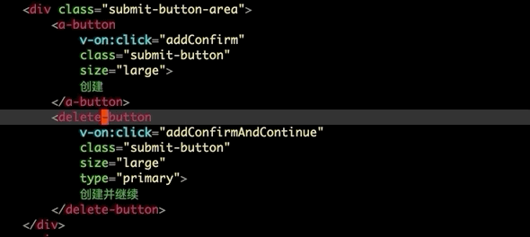

# What is instant-rename-tag?
It's wonderful if we can rename tag instantly, not rename from minibuffer.

And yes, this plugin is design for do this.

## Installation
Clone or download this repository (path of the folder is the `<path-to-instant-rename-tag>` used below).

In your `~/.emacs`, add the following two lines:
```Elisp
(add-to-list 'load-path "<path-to-instant-rename-tag>") ; add instant-rename-tag to your load-path
(require 'instant-rename-tag)
```

Note, this plugin depend on ```web-mode```, you need make sure install ```web-mode``` first.

## Usage
Bind your favorite key to functions:

| Function           | Description                                                               |
| :--------          | :----                                                                     |
| instant-rename-tag | Rename tag under current cursor, call this command again if rename finish |
